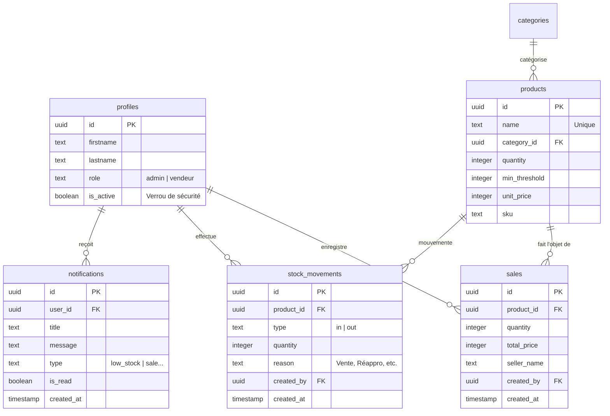

# Schéma de Base de Données - MOUSTO_LELOU Stock

Ce document détaille la structure de la base de données PostgreSQL hébergée sur Supabase pour l'ERP MOUSTO_LELOU.

## 📊 Diagramme Relationnel (ERD)

## 📝 Détails des Tables

### 1. `profiles`
Données étendues des utilisateurs liées à `auth.users`.

| Colonne | Type | Description |
| :--- | :--- | :--- |
| `id` | UUID | Clé primaire (lié à `auth.users.id`) |
| `firstname` | Text | Prénom |
| `lastname` | Text | Nom |
| `role` | Text | Rôle système (`admin` ou `vendeur`) |
| `is_active` | Boolean | État du compte (True = Actif, False = Suspendu) |

### 2. `products`
Catalogue central des articles en stock.

| Colonne | Type | Description |
| :--- | :--- | :--- |
| `id` | UUID | Identifiant unique |
| `name` | Text | Nom de l'article (Unique) |
| `category_id` | UUID | Référence à `categories.id` |
| `quantity` | Integer | Stock physique actuel |
| `min_threshold` | Integer | Seuil de stock critique pour alertes |
| `unit_price` | Integer | Prix de vente unitaire (FG) |
| `sku` | Text | Référence interne (optionnelle) |

### 3. `sales`
Journal des transactions de vente financières.

| Colonne | Type | Description |
| :--- | :--- | :--- |
| `id` | UUID | Identifiant de transaction |
| `product_id` | UUID | Produit vendu |
| `quantity` | Integer | Quantité vendue |
| `total_price` | Integer | Montant total encaissé |
| `seller_name` | Text | Nom affiché du vendeur |
| `created_by` | UUID | ID du profil ayant effectué la vente |

### 4. `stock_movements`
Journal d'audit complet des flux (Entrées / Sorties).

| Colonne | Type | Description |
| :--- | :--- | :--- |
| `id` | UUID | Identifiant unique |
| `product_id` | UUID | Produit concerné |
| `type` | Text | `in` (Entrée) ou `out` (Sortie) |
| `quantity` | Integer | Volume du mouvement |
| `reason` | Text | Libellé (ex: "Vente Validée", "Réappro") |
| `created_by` | UUID | Agent responsable du flux |

### 5. `notifications`
Système d'alertes en temps réel.

| Colonne | Type | Description |
| :--- | :--- | :--- |
| `id` | UUID | Identifiant unique |
| `user_id` | UUID | Destinataire de l'alerte |
| `title` | Text | Titre de la notification |
| `message` | Text | Détails de l'alerte |
| `type` | Text | Catégorie (`low_stock`, `sale`, `info`, `warning`) |
| `is_read` | Boolean | État de lecture |

---

### 📡 Divers
Une table technique `wifi_users` est utilisée pour la gestion des métadonnées de connexion des points d'accès.
